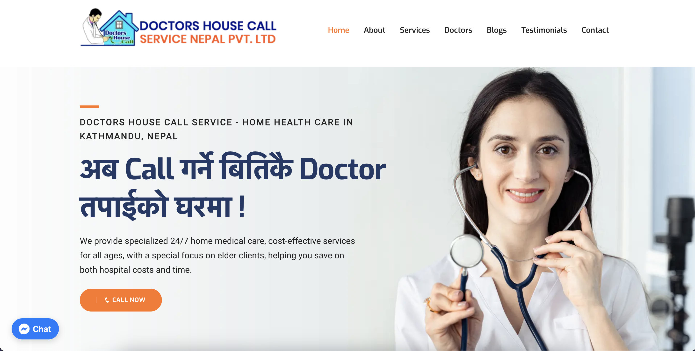

# Doctors House Call Service (DHCS)

## Overview

Doctors House Call Service is a home health care service located in Kathmandu, Nepal, providing 24/7 doctor home visit services.

Key Services:
- [24/7 Nursing Care at Home](https://doctorshousecall.com.np/blogs/home-nursing-care-service-in-nepal/)
- [Doctor Consultation and Minor Procedures](https://doctorshousecall.com.np/blogs/doctor-home-visit-and-online-consultation-nepal/)
- [Lab Test & Sample Collection at Home](https://doctorshousecall.com.np/blogs/whole-body-checkup-lab-blood-test-at-home/)
- [Home-Based Physical Therapy](https://doctorshousecall.com.np/blogs/physiotherapy-at-home-nepal/)
- Home Pharmacy Services
- Convenient Home Ultra Sonography Scans
- ECG Test (Electrocardiogram)
- Healthy Eating & Diet Consultation at Home
- Emergency Patient Air Transport and Escort

Get in touch with DHCS:
- WhatsApp/Viber: +977-9813165183 / +977-9861617998
- Online Appointment: [Form Link](https://doctorshousecall.com.np/appointment/)
- Social Meida:
    - [Facebook](https://www.facebook.com/DoctorsHouseCallServiceNepal)
    - [Instagram](https://www.instagram.com/doctorshousecallservicenepal/)
    - [Twitter](https://twitter.com/doctorshousecal)
    - [LinkedIn](https://np.linkedin.com/company/doctors-house-call-service-nepal)
    - [Youtube](https://www.youtube.com/@Official_doctorshousecall)

## Live Demo

Check out the live website: [Doctors House Call Service](https://doctorshousecall.com.np/)

## Website Features

- Responsive Design
- Online Appointment Section
- Contact and About Page
- Healthcare Blog/Information Section
- Testimonial Section
- Healthcare Professional Profiles
- Facebook Live Chat
- SEO Optimized

## Screenshots

## Technologies Used

- HTML
- CSS
- JavaScript

## Image License

The images used in this website are subject to specific licenses, and their usage rights are reserved. Unless otherwise stated, you do not have permission to use these images for purposes other than viewing the content on this website.

## Usage Restrictions

This repository is public, but you are not allowed to deploy the same project with identical content. It's meant for personal use, and any public deployment should have unique content.

## Contact Information

For inquiries or support, contact at [alonshstha@gmail.com](mailto:alonshstha@gmail.com).

## Acknowledgments

- Special thanks to [ThemeFisher](https://themefisher.com/) for providing the initial template used in the development of this website. You can find the original template [here](https://github.com/themefisher/novena-bootstrap).